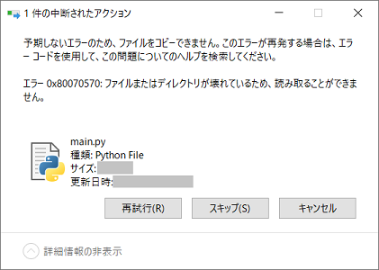
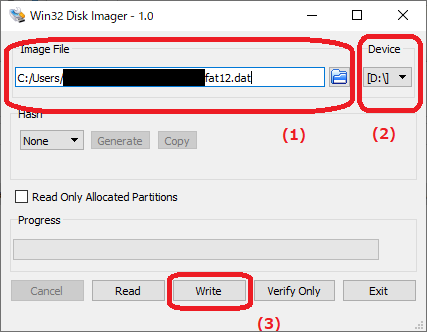

# トラブルシューティング

本ドキュメントでは、Deguを使用する上で陥る可能性のあるトラブルとその対処法について紹介します。

* [main.pyが保存できない](#mainpy_not_save)
* [AWS IoT Coreのシャドウが更新されない](#not_update_shadow)
* [Deguを別のDeguゲートウェイに接続したい](#join_another_gateway)
* [main.pyを保存しようとするとエラーが発生する](#failed_to_update_mainpy)

### <a name="mainpy_not_save">main.pyが保存できない</a>

maiy.pyが保存できない場合、以下の理由が考えられます

* 保存可能な容量を超えている

    main.pyが保存される[FAT12 Partition領域](../../technical_specifications/flash_memory_map/#region_fat12_partition)の容量は16KBですが、この中にはFAT12メタデータも含まれているため、16KB全てを利用することはできません。保存可能な容量を超えている場合は、コメント・改行を減らすなどして容量を削減してください。

* DeguのFlashメモリへmain.pyが書き込まれる前にUSBケーブルを切断している

    [MicroPythonコードの変更](../../user_manual/40_update_user_script)の手順を参考に、「デバイスの安全な取り外し」等の手順を行ってください。


### <a name="not_update_shadow">AWS IoT Coreのシャドウが更新されない</a>

DeguのMACアドレスがAWS IoT Coreの「モノ」として登録されている状態で、Deguの電源を投入してもAWS IoT Core上のシャドウが更新されない場合には、以下の手順をお試しください。

1. Deguの接続情報を初期化する

    [OpenThread Network Information領域](../../technical_specifications/flash_memory_map/#region_openthread_network_infomation)を消去することで、Deguの接続情報を初期化することができます。

    Linux PCにDeguを接続し以下のスクリプトを実行することで、Deguの接続情報を初期化できます。

    ```
    $ wget https://open-degu.github.io/script/degu_delete_con_info.sh
    $ sudo degu_delete_con_info.sh
    ```

1. AWS IoT Core上のデバイスを削除する

    デバイスを削除するには、登録されているモノのページで、`アクション`->`削除` をクリックしてください。
    

1. DeguのMACアドレスをAWS IoT Coreに登録する

    [Deguゲートウェイのセットアップ](../../user_manual/30_setup)の「DeguをAWS IoT Coreに登録する」に従い、再度DeguのMACアドレスを登録してください。

### <a name="join_another_gateway">Deguを別のDeguゲートウェイに接続したい</a>

[AWS IoT Coreのシャドウが更新されない](#not_update_shadow)と同様の手順で、接続情報を消去し、AWS IoT Core上にデバイスを削除・追加してください。

### <a name="failed_to_update_mainpy">main.pyを保存しようとするとエラーが発生する</a>

#### 症状
パソコンにUSB経由でDeguを接続した状態で、main.pyを書き換えようとした際、以下の様なエラーが発生しmain.pyが書き換えられない状態になった。  

```
予期しないエラーのため、ファイルをコピーできませんでした。  
このエラーが再発する場合は、エラーコードを使用して、この本題についてのヘルプを検索してください。  
エラー0x80070570:ファイルまたはディレクトリーが壊れているため、読み取ることができません。
```



#### 原因

Deguのファイルシステムが壊れたことにより発生したエラーと考えられます。  

#### 対処方法

下記の初期化手順でDeguのFAT12 Partition領域を初期化してください。  
Partition領域参考) https://open-degu.github.io/technical_specifications/flash_memory_map/#region_usb_mass_storage  

この作業により main.py は初期状態に戻ってしまうため、実施前に現在Deguに書き込んでいるmain.pyをPC等に退避してください。  
※ Degu上に異なるファイル名(__main.py等)で退避しても、ファイルシステムを初期化するため、初期化後はファイルが消滅します。

##### 初期化手順
1. 初期化に使用するファイル fat12.dat をダウンロードします。  
   [こちら](https://github.com/open-degu/degu/raw/master/dat/fat12.dat "fat12.dat") から初期化に使用するファイルをダウンロードします。     

1. DeguをWindows PCまたはLinux PCにUSB接続します。

1. 初期化を実施します。  

   [Windows]  
   1) ここでは、Win32 Disk Imagerを用いた手順を説明します。  
      下記URLよりバイナリをダウンロードし、インストールを実施してください。  
      https://ja.osdn.net/projects/sfnet_win32diskimager/
   2) ツールを起動し、添付ファイル画像の通りファイルやドライブを指定、実行してください。  
      (1) 上記でダウンロードしたfat12.datを指定  
      (2) Deguのドライブを指定  
      (3) 書き込み実行  
        
   3) "Write Successful." と表示されれば完了です。  

   [Linux]  
   1) 下記のコマンドを実行してください。  
    ```
    LinuxPC $ sudo dd if=fat12.dat bs=1k count=16 of=/dev/sdx conv=fsync,nocreat
    ```
    注1) /dev/sdx の x はPCに接続した Degu以外のストレージデバイスによって変わるため、必ずDeguを接続した時に作られるファイルを指定してください。  
    注2) ifオプションで指定するfat12.datは手順1.でダウンロードしたfat12.datのファイルパスを指定してください。
