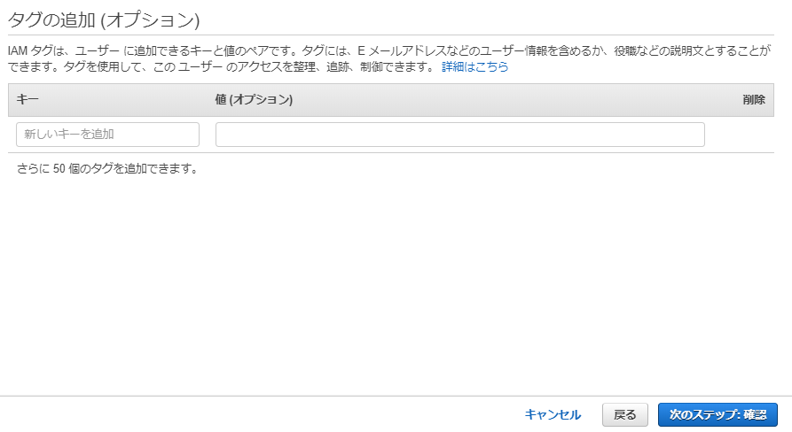
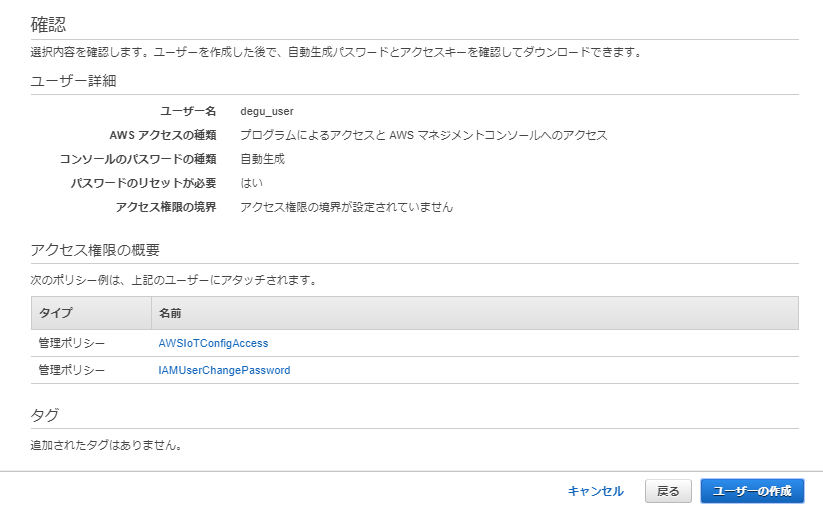
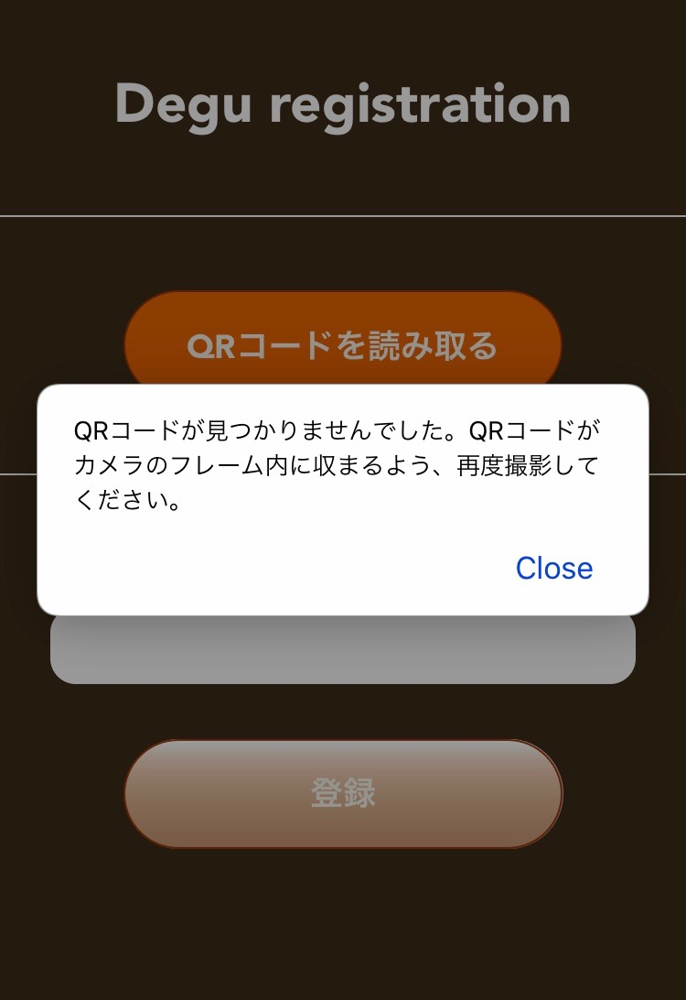
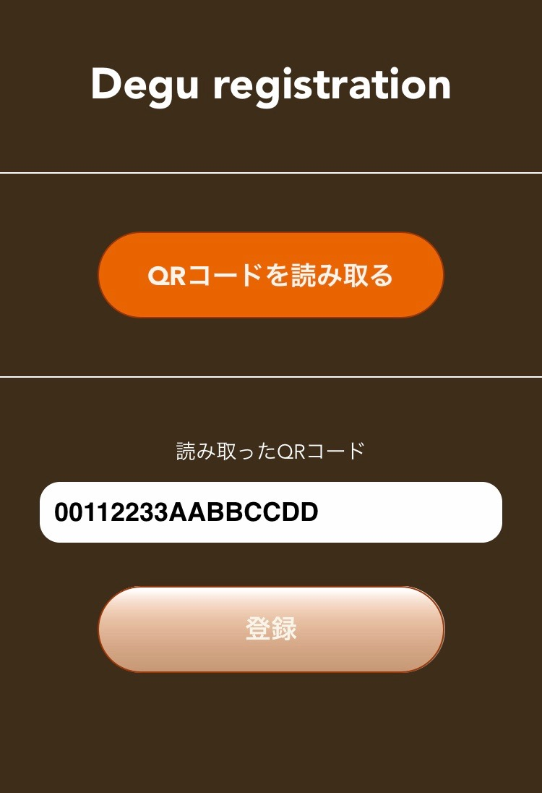
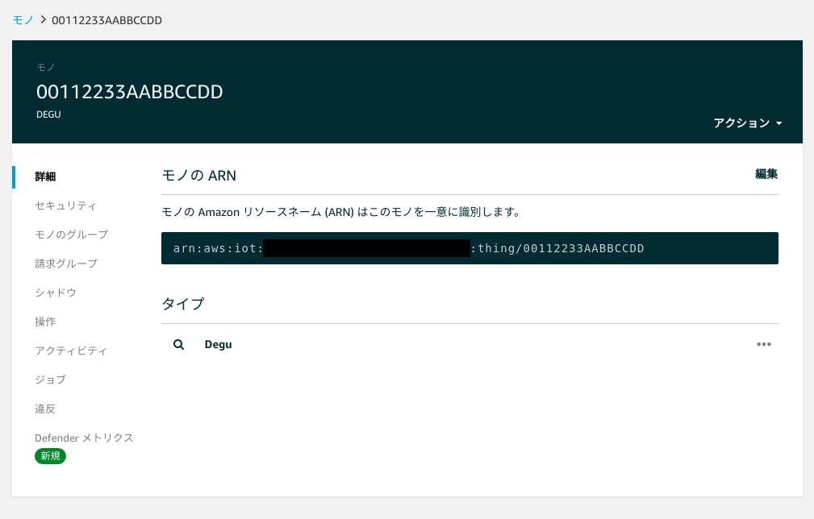
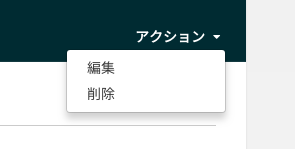
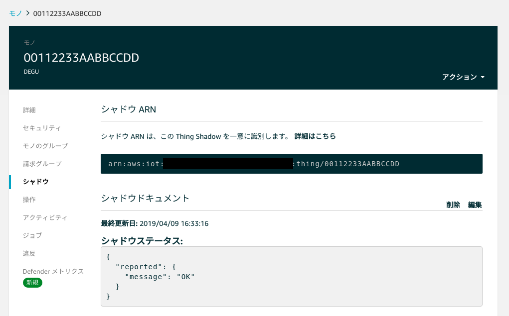

# Deguゲートウェイのセットアップ

Deguゲートウェイをセットアップし、これにDeguを接続する手順を示します。

## AWSの設定

この手順は、既に **AWSのアカウントを作成し、AWSマネジメントコンソールにログインできていること** を前提としています。AWSアカウントの作成方法については、 [こちら](https://aws.amazon.com/jp/register-flow/) を参照してください。

## IAMユーザー作成

AWSマネジメントコンソールへログインし、サービス一覧から**IAM**を選択してください。その後、ユーザータブを開き、「ユーザーを追加」をクリックします。

### ユーザーを追加
下記の通り入力、選択し「次のステップ: アクセス権限」に進みます。

* ユーザー名
* AWSアクセスの種類を**両方**選択
* コンソールのパスワードは**自動生成パスワード**を選択
* 「パスワードのリセットが必要」に**チェック**を入れる


### アクセス許可の設定
下記の手順でポリシーをアタッチし、「次のステップ: アクセス権限」に進みます。

* 「既存のポリシーを直接アタッチ」を選択
* ポリシーのフィルタに**AWSIoTConfigAccess**と入力
* 表示された**AWSIoTConfigAccess**にチェック


### タグの追加(オプション)
今回は設定不要です。「次のステップ: 確認」に進みます。


### 確認画面
確認画面が表示されます。設定した通りの内容になっていることを確認し、「ユーザーの作成」をクリックしてください。  


### IAMユーザー作成完了
成功すると下記のような画面が表示されます。  
後ほどDeguゲートウェイの設定で使用するため、ここでは必ず**csvのダウンロード**を忘れずに行ってください。
行わなかった場合、再度IAMユーザーを作成する必要があります。  


ダウンロードしたファイル(accessKey.csv)の内容は、以下の様なカンマ区切りの文字列になります。  
この例の場合、Access key IDの値は `AWS123` で、Secret access keyの値は `asdfghjkl` です。
```
Access key ID,Secret access key
AWS123,asdfghjkl
```

## Deguゲートウェイの設定

    Deguゲートウェイの操作方法や設定ファイルの編集方法については、各製品のマニュアルを参照してください。

### rootのパスワードの変更

Deguゲートウェイの設定は、スーパーユーザーで実行します。  
初期パスワードのままだとセキュリティリスクが高まるため、必ず初期パスワードを変更してください。

```
# passwd
Enter new UNIX password: # 新しいパスワードを入力
Retype new UNIX password: # 再入力
```

### DeguゲートウェイをAWS IoTへ登録する

Deguゲートウェイは、AWS IoTへの登録・通信にECDSA署名の証明書を使う必要がある為、AWSへ登録する際に独自のCA証明書を準備する必要があります。  
この手順の概要は、AWS IoT 開発者ガイド [『自前の証明書を使用する』](https://docs.aws.amazon.com/ja_jp/iot/latest/developerguide/device-certs-your-own.html "自前の証明書を使用する") を参照ください。  
以下2パターンのどちらかで実施する必要があります。  

1. CA証明書のみを準備・登録する  
    CA証明書の生成とAWS IoTへの登録を事前に行い、デバイス証明書はDeguゲートウェイが自動生成します。  
    DeguゲートウェイにはCA証明書とCA証明書のキーペアを設置する必要があります。

1. CA証明書とデバイス証明書を事前に準備する  
    CA証明書の生成とAWS IoTへの登録、及びDeguゲートウェイのデバイス証明書を事前に生成します。  
    DeguゲートウェイにはCA証明書、デバイス証明書そしてデバイス証明書のキーペアを設置する必要があります。

ここでは「CA証明書のみを準備・登録する」手順を紹介します。

#### CA証明書の作成、AWS IoTへの登録、Deguゲートウェイへの設置

暗号化方式がECDSAの証明書を購入する手段もありますが、ここでは[OpenSSL](https://www.openssl.org/ "OpenSSL") バージョン1.0.2以上をインストールしてあるLinux PC上で、opensslコマンドを使用し証明書を作成する手順を紹介します。  
関連するファイルの名称と意味を以下に示します。

| ファイル名 | ファイルの意味 |
----|---- 
| ca.pem.key | CA証明書用キーペア |
| ca.pem.crt | CA証明書 |
| verification.pem.key | CA証明書プライベートキー検証用キーペア |
| verification.pem.csr | CA証明書プライベートキー検証用CSR |
| verification.pem.crt | CA証明書プライベートキー検証用証明書 |

    Linux PCは、Debian系Linuxで動作確認をしています。  
    Debian系Linux以外のディストリビューションをご利用の場合、コマンドが異なる可能性があります。

##### awscliのインストール

aws関連のコマンドを使用する為に、Linux PCにawscliをインストールします。

    ```
    LinuxPC $ sudo apt install awscli
    ```

##### CA証明書の作成

この証明書は、同一のAWSアカウントで管理する全てのDeguゲートウェイで使用します。

1. CA証明書用キーペアを作成します。

    ```
    LinuxPC $ openssl ecparam -genkey -name prime256v1 -out ca.pem.key
    ```

1. CA証明書を作成します。CN(Common Name) `####`は任意の値を設定できます。

    ```
    LinuxPC $ openssl req -x509 -new -nodes -key ca.pem.key -sha256 -days 3650 -out ca.pem.crt -subj "/CN=####"
    ```

    CNに`Degu Gateway CA`と設定する場合は以下の様になります。
    ```
    LinuxPC $ openssl req -x509 -new -nodes -key ca.pem.key -sha256 -days 3650 -out ca.pem.crt -subj "/CN=Degu Gateway CA"
    ```


##### CA証明書プライベートキー検証用証明書の作成

AWS IoTへCA証明書を登録する為にCA証明書プライベートキー検証用証明書を作成します。

1. CA証明書プライベートキー検証用キーペアを作成します。

    ```
    LinuxPC $ openssl ecparam -genkey -name prime256v1 -out verification.pem.key
    ```

1. Linux PCで、AWSのコンフィグレーションを行っていない場合は実施します。

    aws configureコマンドの後に各パラメーターの入力を求められます。  
    パラメーター入力例は、以下の通りです。
    ```
    LinuxPC $ aws configure
    AWS Access Key ID [None]: AWS123
    AWS Secret Access Key [None]: asdfghjkl
    Default region name [None]: ap-northeast-1
    Default output format [None]: json
    ```

    * AWS Access Key IDとAWS Secret Access Keyは、  
        IAMユーザー作成時にダウンロードしたcsvファイル(accessKey.csv)に記載されています。
        accessKey.csvの内容が、
        ```
        Access key ID,Secret access key
        AWS123,asdfghjkl
        ```
        の場合、Secret access keyは `asdfghjkl` 、Access key IDは `AWS123` となります。

    * Default region nameは、エンドポイントから取得できます。  
        エンドポイントの確認方法は、  
        * AWSマネジメントコンソールへログインし、  
        * サービス一覧から**IoT Core**を選択してください。  
        * 画面左下の「設定」タブを開き、カスタムエンドポイントに表示されている文字列がエンドポイントです。  

        表示されているエンドポイントが、 `xxxxxxx-xxx.iot.ap-northeast-1.amazonaws.com` の場合、  
        Default region nameは `ap-northeast-1` になります。

    * Default output formatは、`json` を設定してください。

1. AWS IoT registration codeを取得します。

    ```
    LinuxPC $ aws iot get-registration-code
    {
        "registrationCode": "##MY_REGISTRATION_CODE##"
    }
    ```

    aws iot get-registration-codeコマンドの結果が以下の場合、  
    `##MY_REGISTRATION_CODE##` は `1234567890abcdef` です。

    ```
    atmark@armadillo:~$ aws iot get-registration-code
    {
        "registrationCode": "1234567890abcdef"
    }
    ```

1. CA証明書プライベートキー検証用CSRを作成します。

    ```
    LinuxPC $ openssl req -new -key verification.pem.key -subj "/CN=##MY_REGISTRATION_CODE##" -out verification.pem.csr
    ```

    `##MY_REGISTRATION_CODE##` が `1234567890abcdef` であれば、以下の様に入力します。

    ```
    LinuxPC $ openssl req -new -key verification.pem.key -subj "/CN=1234567890abcdef" -out verification.pem.csr
    ```

1. CA証明書プライベートキー検証用証明書を作成します。

    ```
    LinuxPC $ openssl x509 -req -in verification.pem.csr -CA ca.pem.crt -CAkey ca.pem.key -CAcreateserial -out verification.pem.crt -days 500 -sha256
    ```

##### CA証明書をAWS IoTへ登録

1. CA証明書をAWS IoTへ登録します。

    ```
    LinuxPC $ aws iot register-ca-certificate --ca-certificate file://ca.pem.crt --verification-cert file://verification.pem.crt
    {
        "certificateId": "##MY_CERT_ID##" 
        "certificateArn": "##MY_CERT_ARN##",
    }
    ```

    aws iot register-ca-certificateコマンドの結果、以下の様に表示された場合、  
    `##MY_CERT_ID##` は `abc123def456` です。

    ```
    LinuxPC $ aws iot register-ca-certificate --ca-certificate file://ca.pem.crt --verification-cert file://verification.pem.crt
    {
        "certificateId": "abc123def456",
        "certificateArn": "arn:aws:iot:ap-northeast-1:12345678:cacert/abcdefghijklm"
    }
    ```

1. CA証明書を有効化し、自動登録を有効化します。

    `##MY_CERT_ID##`は、AWS IoTへ登録した際"certificateId"に表示された値を設定します。

    ```
    LinuxPC $ aws iot update-ca-certificate --certificate-id ##MY_CERT_ID## --new-status ACTIVE
    LinuxPC $ aws iot update-ca-certificate --certificate-id ##MY_CERT_ID## --new-auto-registration-status ENABLE
    ```

    `##MY_CERT_ID##` が　`abc123def456` の場合、以下の様に入力します。

    ```
    LinuxPC $ aws iot update-ca-certificate --certificate-id abc123def456 --new-status ACTIVE
    LinuxPC $ aws iot update-ca-certificate --certificate-id abc123def456 --new-auto-registration-status ENABLE
    ```

##### CA証明書をDeguゲートウェイへコピー
CA証明書用キーペア、CA証明書をDeguゲートウェイ内の所定の場所へコピーします。

1. Linux PCからDeguゲートウェイへコピーします。

    ```
    LinuxPC $ scp ca.pem.key ユーザーID@IPアドレス:/home/ユーザー名/.
    LinuxPC $ scp ca.pem.crt ユーザーID@IPアドレス:/home/ユーザー名/.
    ```

1. Deguゲートウェイ内で、後述するAWS情報設定ファイル(mqtt_info.json)に記載する場所へ移動します。

    /etc/coap-mqtt/に設置する場合のコマンドは以下の通りです。

    ```
    DeguGW # mv /home/ユーザー名/ca.pem.key /etc/coap-mqtt/.
    DeguGW # mv /home/ユーザー名/ca.pem.crt /etc/coap-mqtt/.
    ```

#### DeguゲートウェイをAWS IoTへ登録

以下に示す『AWS情報設定ファイルの編集』実施後、Deguゲートウェイを再起動すると、  
自動的にAWS IoTへDeguゲートウェイが登録されます。

### AWS情報設定ファイルの編集

1. 設定ファイル `mqttinfo.json` をテキストエディタで開きます。

```
DeguGW # vi /etc/coap-mqtt/mqttinfo.json
```

* mqttinfo.json <デフォルト>

  ```
    {
      "key" : "/etc/coap-mqtt/private.pem.key",
      "cert" : "/etc/coap-mqtt/certificate.pem.crt",
      "cafile" : "/etc/coap-mqtt/RootCA.crt",
      "aws_endpoint" : "",
      "secretaccesskey" : "",
      "accesskeyid" : "",
      "region" : "",
      "gw": {
        "preset": {
          "ca": {
            "=comment=" : [
              "you must set ca certificate file and put it.",
              "if you do not create device certificate,",
              "you must set key file path and put it."],
            "key"  : "",
            "cert" : "/etc/coap-mqtt/..."
          },
          "device": {
            "=comment=" : [
              "if you already create device certificate,",
              "set certificate and key pair on this device and write file path."],
            "key"  : "",
            "cert" : ""
          }
        },
        "=comment=" : "===== do not change below properties. =====",
        "mqtt": {
          "cert" : "/etc/coap-mqtt/deviceAndCa.crt.pem",
          "key"  : "/etc/coap-mqtt/device.ref.key.pem",
          "ca"   : "/etc/coap-mqtt/AmazonRootCA3.pem"
        }
      }
    }
    ```

    6項目を編集します。
    * aws_endpoint
    * secretaccesskey
    * accesskeyid
    * region
    * gw: preset: ca: cert
    * gw: preset: ca: key

#### aws_endpoint
IoT Coreのエンドポイントを指定します。  
AWSマネジメントコンソールへログインし、サービス一覧から**IoT Core**を選択してください。  
「設定」タブを開き、カスタムエンドポイントに表示されているエンドポイントをコピー、下記の通り修正します。

* エンドポイントが `xxxxx.iot.ap-northeast-1.amazonaws.com` の場合
```
  "aws_endpoint" : "xxxxx.iot.ap-northeast-1.amazonaws.com",
```

#### secretaccesskey
シークレットアクセスキーを指定します。  
IAMユーザー作成時にダウンロードしたcsvファイル(accessKey.csv)に記載されています。

* accessKey.csvの内容が、
```
Access key ID,Secret access key
AWS123,asdfghjkl
```
の場合、Secret access keyは `asdfghjkl` となりますので、以下のように設定します。
```
  "secretaccesskey" : "asdfghjkl",
```

#### accesskeyid
アクセスキーIDを指定します。  
IAMユーザー作成時にダウンロードしたcsvファイル(accessKey.csv)に記載されています。

* accessKey.csvの内容が、
```
Access key ID,Secret access key
AWS123,asdfghjkl
```
の場合、Access key IDは `AWS123` となりますので、以下のように設定します。
```
  "accesskeyid" : "AWS123",
```

#### region
リージョンを指定します。  
エンドポイントから取得できます。

* エンドポイントが xxxxx.iot.ap-northeast-1.amazonaws.com の場合
```
  "region" : "ap-northeast-1"
```

#### gw: preset: ca: key
CA証明書キーペアの設置先を指定します。

* 設置したパスが`/etc/coap-mqtt/ca.pem.key`の場合
```
        "preset": {
          "ca": {
            ...
            "key"  : "/etc/coap-mqtt/ca.pem.key",
```

#### gw: preset: ca: cert
CA証明書の設置先を指定します。

* 設置したパスが`/etc/coap-mqtt/ca.pem.crt`の場合
```
        "preset": {
          "ca": {
            ...
            "cert"  : "/etc/coap-mqtt/ca.pem.crt",
```

#### mqttinfo.json <編集後>

```
{
  "key" : "/etc/coap-mqtt/private.pem.key",
  "cert" : "/etc/coap-mqtt/certificate.pem.crt",
  "cafile" : "/etc/coap-mqtt/RootCA.crt",
  "aws_endpoint" : "xxxxx.iot.ap-northeast-1.amazonaws.com",
  "secretaccesskey" : "asdfghjkl",
  "accesskeyid" : "AWS123",
  "region" : "ap-northeast-1",
  "gw": {
    "preset": {
      "ca": {
        "=comment=" : [
          "you must set ca certificate file and put it.",
          "if you do not create device certificate,",
          "you must set key file path and put it."],
        "key"  : "/etc/coap-mqtt/ca.pem.key",
        "cert" : "/etc/coap-mqtt/ca.pem.crt"
      },
      "device": {
        "=comment=" : [
          "if you already create device certificate,",
          "set certificate and key pair on this device and write file path."],
        "key"  : "",
        "cert" : ""
      }
    },
    "=comment=" : "===== do not change below properties. =====",
    "mqtt": {
      "cert" : "/etc/coap-mqtt/deviceAndCa.crt.pem",
      "key"  : "/etc/coap-mqtt/device.ref.key.pem",
      "ca"   : "/etc/coap-mqtt/AmazonRootCA3.pem"
    }
  }
}
```

### アクセスポイント情報を変更する
Deguゲートウェイは各Deguを接続するために無線LANアクセスポイントとして動作します。デフォルトでは、次のSSIDとパスフレーズが設定されています。  

  | SSID | パスフレーズ |
  |:-----------|:------------|
  | MyAccessPoint | 12345678 |

デフォルトの設定のままで運用すると、パスフレーズを把握している誰もがアクセスできてしまいます。必ずアクセスポイント情報を任意のものに再設定してください。

#### アクセスポイント設定ファイルの編集
1. 設定ファイル `create_ap.conf` をテキストエディターで開いてください。

    ```
    DeguGW # vi /etc/create_ap.conf
    ```

1. `create_ap.conf`を編集してください。

    * /etc/create_ap.conf

    ```
    CHANNEL=default
    GATEWAY=10.0.0.1
    WPA_VERSION=2
    ETC_HOSTS=0
    DHCP_DNS=gateway
    NO_DNS=0
    NO_DNSMASQ=0
    HIDDEN=0
    MAC_FILTER=0
    MAC_FILTER_ACCEPT=/etc/hostapd/hostapd.accept
    ISOLATE_CLIENTS=0
    SHARE_METHOD=nat
    IEEE80211N=0
    IEEE80211AC=0
    HT_CAPAB=[HT40+]
    VHT_CAPAB=
    DRIVER=nl80211
    NO_VIRT=0
    COUNTRY=
    FREQ_BAND=2.4
    NEW_MACADDR=
    DAEMONIZE=0
    NO_HAVEGED=0
    WIFI_IFACE=wlan0
    INTERNET_IFACE=eth0
    SSID=MyAccessPoint
    PASSPHRASE=12345678
    USE_PSK=0
    ```

    2点の項目を編集します。
    * SSID
    * PASSPHRASE

    SSIDを "DeguGW"、パスフレーズを "degu-pass" とする場合、次のように変更します。

    ```
    SSID=DeguGW
    PASSPHRASE=degu-pass
    ```

    ※SSIDは1〜32文字、パスフレーズは8〜63文字の間で指定して下さい。

1. `create_ap.conf`の編集後、Deguゲートウェイを再起動してください。

    ```
    DeguGW # reboot
    ```

1. 再起動後、設定したアクセスポイントにスマートフォンやPCで接続できることを確認します。

### DeguをAWS IoT Coreに登録する

Deguゲートウェイに無線LANで接続したスマートフォンやPCを使って、Deguの登録を行うことができます。

1. アクセスポイントに接続後、Webブラウザで `http://10.0.0.1/degu/` にアクセスすると、次のようなページが表示されます。

    

    アクセスできない場合は次の項目を確認してください。
    * アクセスポイントが正しく設定されているか
    * 異なるアクセスポイントに接続していないか

1. DeguのMACアドレスを登録します。

    MACアドレスを登録するには2つの方法があります。

    * QRコードを読み取る
    * MACアドレスを直接入力する

#### QRコードを読み取る

1. `QRコードを読み取る` ボタンをタップすると、カメラが起動します。もし、カメラへのアクセスが許可されていない場合はアクセス許可の設定を行ってください。
PCで接続した場合は、ファイル選択画面が表示されます。このときは、QRコードを撮影した画像をアップロードしてください。

1. Degu本体ケース裏面のQRコードをカメラで撮影します。

    QRコードが小さいと読み込みを行うことができないため、拡大して撮影してください。読み取れない場合は下記のエラーが表示されます。

    

1. 正しく読み込めた場合、`読み取ったQRコード`にMACアドレスが表示されます。表示されている内容がQRコードの左側に記載されている12桁の英数字と一致しているか確認し、`登録`をタップしてください。なお、QRコードの読み込みが失敗した状態(`読み取ったQRコード`が空欄)で`登録`をタップすると、`No mac address`と表示されます。このときは、再度QRコードの読み込みを行ってください。

    

#### MACアドレスを直接入力する

1. `読み取ったQRコード`の下の欄は、直接MACアドレスを入力することができます。この時、アルファベットは**大文字**で入力してください。空欄の状態で`登録`をタップすると`No mac address`と表示されます。このときは、再度入力を行ってください。なお、入力したMACアドレスの正当性確認は行っておりません。誤った内容で`登録`をタップすると入力した内容のままAWS IoTに登録されてしまい、AWS IoT上での削除操作等が必要になるためご注意ください。

1. `登録`をタップ後、`読み取ったQRコード`の下の欄が空欄になったら登録完了です。AWS IoT Coreの「モノ」に、現在登録したDeguのMACアドレスがデバイスとして登録されていることを確認してください。

    

    次の場合は、AWS IoTに登録されたデバイスを削除し、再度デバイスの登録作業を行ってください。
    * アルファベットの大文字・小文字両方のデバイス名が登録されている
    * MACアドレスと異なる名前で登録されている

    デバイスを削除するには、登録されているモノのページで、`アクション`->`削除` をクリックしてください。
    

### DeguをDeguゲートウェイへ接続する

1. DeguをAWS IoT Coreに登録してから、5分以内にDeguの電源を入れてください。既にDeguの電源が入っていた場合は、再度電源を入れ直してください。

1. 数十秒後、DeguとDeguゲートウェイとの接続が確立します。接続が確立すると、DeguのLED1が点灯します。

1. Deguゲートウェイが正しくインターネットに接続されている場合、Deguが送信したJSONメッセージが、AWS IoT Core上のモノのシャドウに反映されます。

    
