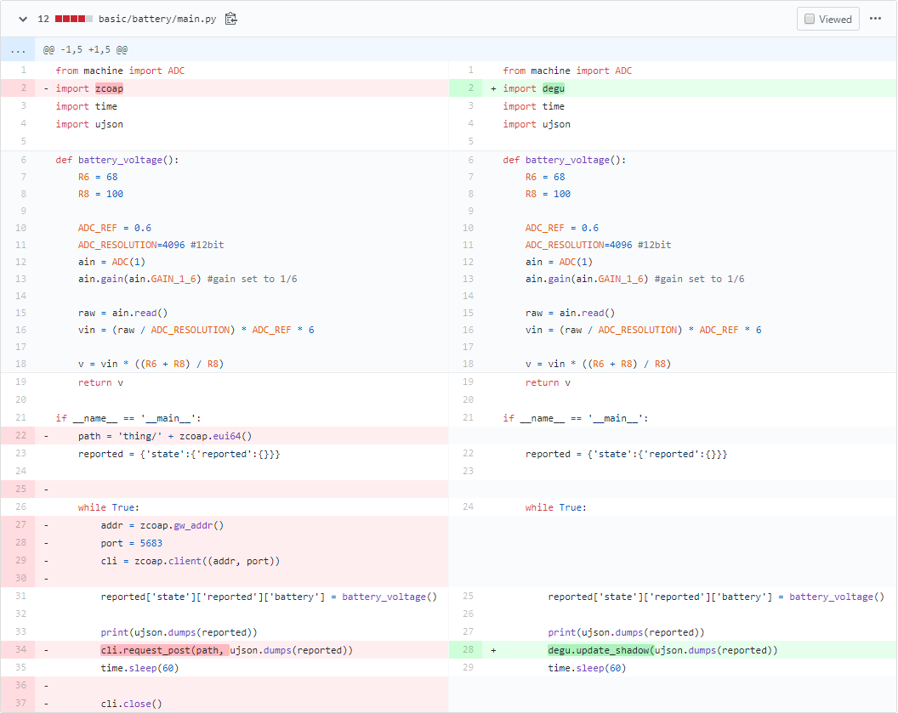

# 概要

Degu v1.0.0-rc1は、v0.9.x系から様々な変更が含まれています。  
AWSにアクセスする際の、証明書のフォーマットや管理方法が変更となった為、Degu及びDeguゲートウェイのAWS IoT Coreへの再登録が必要となります。  
ここでは、Degu v1.0.0-rc1へのバージョンアップ手順を説明します。

# Degu GWの更新

## AWS IoT CoreのモノからDegu ゲートウェイを削除

AWS IoT Core上で、Deguゲートウェイのモノを削除してください。  
登録されているモノのページで、`アクション`->`削除`をクリックしてください。  


## CA証明書を作成し、AWS IoT Coreへ登録

Linux PC上で、[Deguゲートウェイのセットアップ](https://open-degu.github.io/user_manual/30_setup/) の『CA証明書の作成、AWS IoT Coreへの登録、Deguゲートウェイへの設置』を参照し、CA証明書の作成とAWS IoT Coreへの登録を行ってください。

## Deguゲートウェイのパッケージを更新

degu-managerを最新バージョンにアップデートします。  
関連するパッケージも更新されます。  

```
DeguGW # apt update
DeguGW # apt install degu-manager
```
Degu v1.0.0-rc1に対応する、Deguゲートウェイ側Debianパッケージのバージョンは以下の通りです。

| パッケージ名 | パッケージバージョン |
----|----
| degu-manager | 2.0.0-1 |
| coap-mqtt-bridge | 2.0.0-1 |
| degugw-mqtt-client | 2.0.0-1 |
| ibengine-a71ch-openssl | 1.0.0-1 |

パッケージcoap-mqtt-bridgeを更新する際、以下のようなメッセージが表示されることがあります。
```
configuration file '/etc/coap-mqtt/mqttinfo.json'
 ==> Modified (by you or by a script) since installation.
 ==> Package distributor has shipped an updated version.
   What would you like to do about it ?  Your options are:
    Y or I  : install the package maintainer's version
    N or O  : keep your currently-installed version
      D     : show the differences between the versions
      Z     : start a shell to examine the situation
 The default action is to keep your current version.
*** mqttinfo.json (Y/I/N/O/D/Z) [default=N] ?

```
このメッセージが表示された場合、一旦`D`を押し差分を表示します。  
更新前の設定ファイルの以下の内容を別な場所に控えておいてください。
```
"aws_endpoint" : "my_endpoint",
"secretaccesskey" : "my_accesskey",
"accesskeyid" : "my_accesskeyid",
"region" : "my_region",
```

控えた上で、`Y`を押して設定ファイルを更新してください。

## CA証明書とキーペアをDeguゲートウェイに設置

[Deguゲートウェイのセットアップ](https://open-degu.github.io/user_manual/30_setup/) の『CA証明書をDeguゲートウェイへコピー』を参照し、`CA証明書を作成し、AWS IoT Coreへ登録`で作成したCA証明書とキーペアを、Deguゲートウェイに設置してください。

## AWS情報設定ファイルの編集

[Deguゲートウェイのセットアップ](https://open-degu.github.io/user_manual/30_setup/) 『AWS情報設定ファイルの編集』を参照し、AWS情報設定ファイルを編集してください。 
`Deguゲートウェイのパッケージを更新`で控えた各項目の値はここで使用します。

## Degu ゲートウェイをAWS IoT Coreへ再登録

[Deguゲートウェイのセットアップ](https://open-degu.github.io/user_manual/30_setup/) の『DeguゲートウェイをAWS IoTへ登録』を参照し、DeguゲートウェイをAWS IoT Coreへ再登録してください。

# Deguの更新

## ネットワーク情報のクリアとAWS IoT Coreへの再登録

[AWS IoT Coreのシャドウが更新されない](https://open-degu.github.io/trouble_shooting#not_update_shadow)を参照し、Degu内のネットワーク情報をクリアし、AWS IoT Coreへ再登録してください。

## Deguファームウェアの更新

[最新の状態へのアップデート](https://open-degu.github.io/user_manual/20_software_update/)の手順を参照し、Deguファームウェアを最新にしてください。
v1.0.0-rc1のファームウェアは、https://github.com/open-degu/degu/releases/tag/v1.0.0-rc1 に存在します。

## main.py更新

### サンプルをそのまま使用している場合

[サンプルコード](https://github.com/open-degu/degu-micropython-samples) から最新のサンプルコードをダウンロードし、Deguに適用してください。

### 独自のmain.pyをご利用の場合

おおまかな変更方針は以下の通りです。

* import zcoapの箇所をimport deguに置き換えてください。
* cli.request_post()をdegu.update_shadow()に置き換えてください。
* ポート番号の指定など細かい指定が不要となります。

例として、バッテリー残量センサーの差分は以下の通りです。


### main.pyの適用方法

[MicroPythonコードの変更](https://open-degu.github.io/user_manual/40_update_user_script/)を参照し、Deguに新しいmain.pyを上書きしてください。
